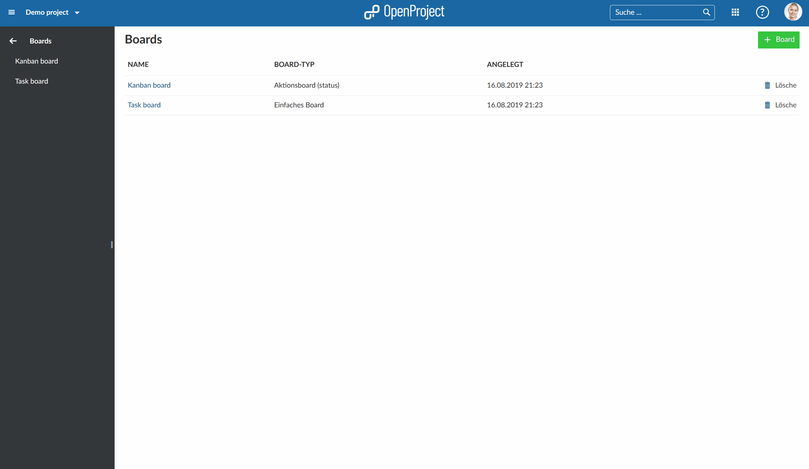

# Introduction to agile Boards (Premium feature)

In this document you will get a first introduction to the Boards in OpenProject, i.e. how to use a Kanban board to manage your tasks in an agile way.

To find out more about the functionalities of Boards, please visit our [user guide for Gantt charts](/user-guide/boards).

| Feature                                                    | Documentation for                          |
| ---------------------------------------------------------- | ------------------------------------------ |
| [What is a Board?](#what-is-a-board?)                      | Find out what is a Board in OpenProject.   |
| [Manage your work in a Board](manage-your-work-in-a-board) | How to manage your work in an agile Board? |

## What is a Board?

Agile Boards in OpenProject support teams in their agile project management methodology, e.g. Scrum or Kanban.

You can create as many flexible boards as you want with both lists and cards on it. A list usually represents a workflow, e.g. status or versions of a work package. The cards are work packages, e.g. tasks, on this list.

<iframe width="560" height="315" src="https://www.youtube.com/embed/Z7iE_BNCDus" frameborder="0" allow="accelerometer; autoplay; encrypted-media; gyroscope; picture-in-picture" allowfullscreen></iframe>
## Manage your work in a Board

To manage your work in an agile board, open the Boards module in the project menu.

1. Choose a board from the list where you want to work on. Open it by double clicking on the board's titel.
2. You can prioritize cards within a list via drag and drop.
3. You can add a card to a new list in the sae way.
4. You can edit the details of a card by **double click**ing on the card.
5. Finally the arrow brings you back to the boards view.

