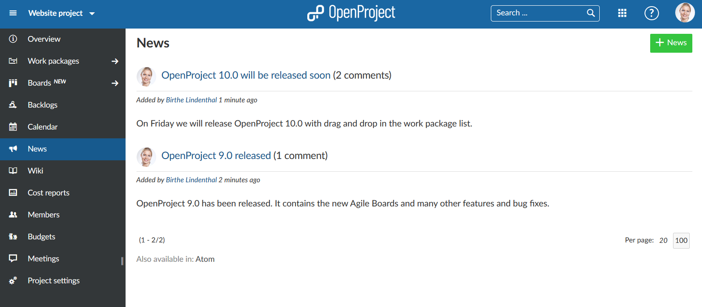
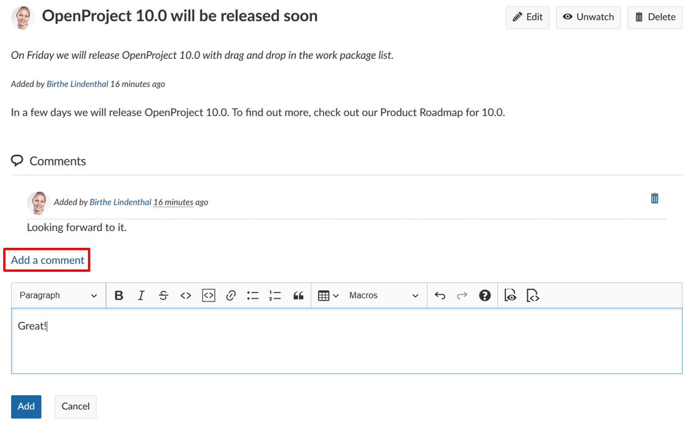
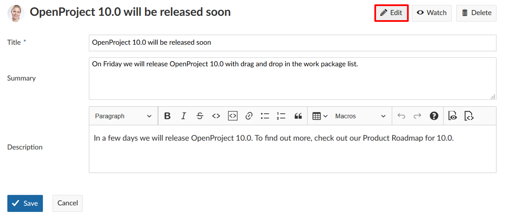
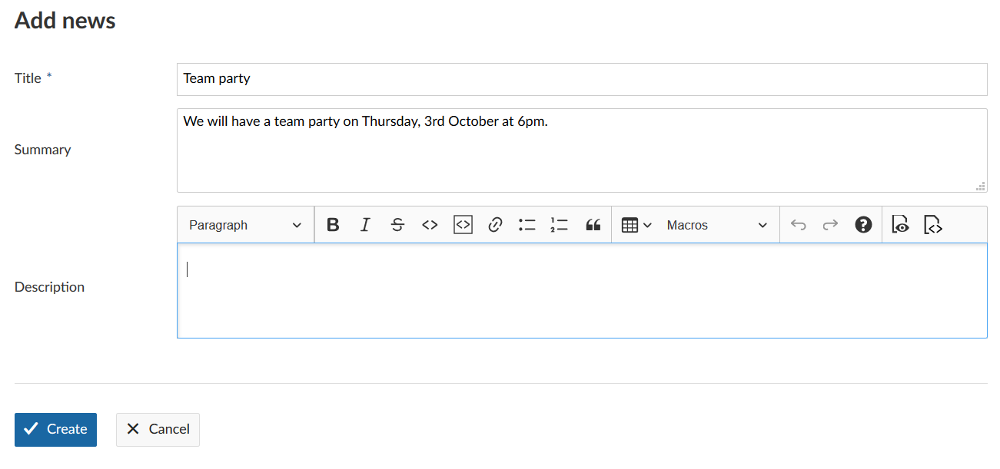
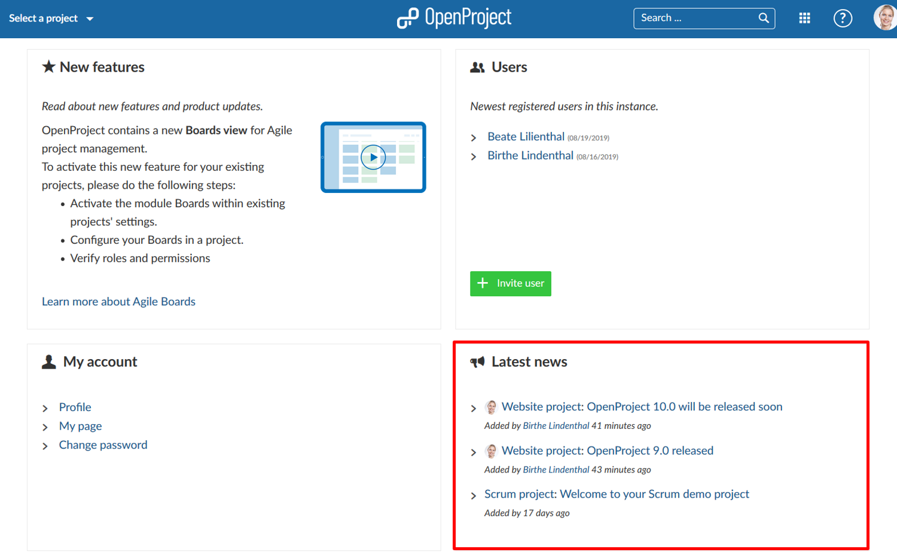
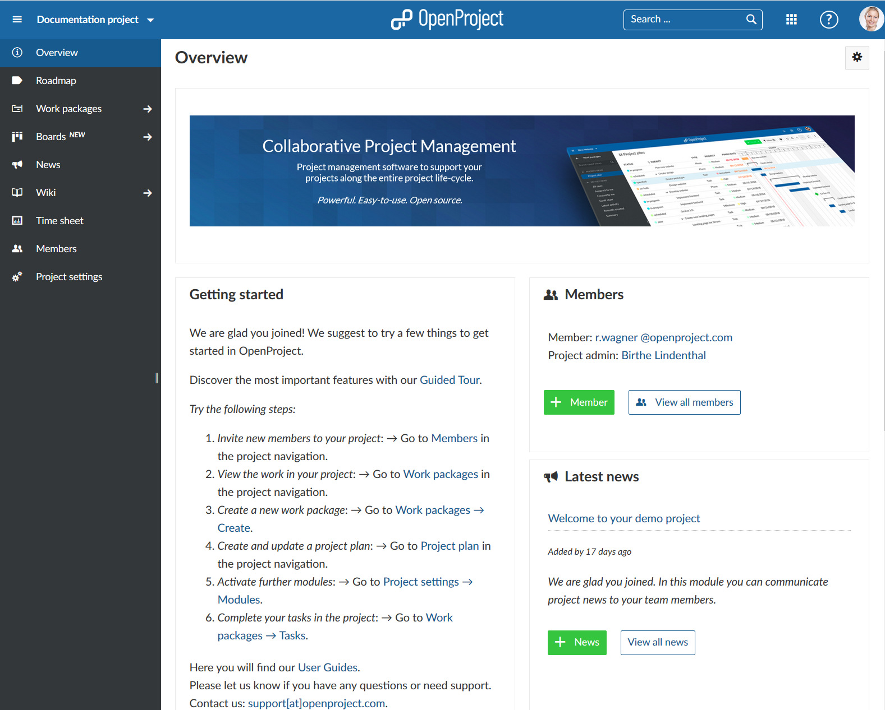

---
sidebar_navigation:
  title: News
  priority: 830
description: Communicate project news to your team members
robots: index, follow
keywords: news
---

# Project News

On the news page, you can see the latest news in a project in reverse chronological order. News communicate general topics to all team members.

They can be displayed on the main project overview page.

| Feature                                     | Documentation for                                 |
| ------------------------------------------- | ------------------------------------------------- |
| [Comment on news](#comment-on-news)         | How to comment news in a project?                 |
| [Watch news](#watch-a-news-entry)           | How to add yourself as a watcher to a news entry? |
| [Edit a news entry](#edi-a-news-entry)      | How to edit an existing news entry?               |
| [Add a news entry](#add-a-news-entry)       | How to create a new news entry?                   |
| [Delete a news entry](#delete-a-news-entry) | How to delete a news entry?                       |

## Comment on news

In the News module in the project menu on the left, you will see all news from a project. Click the Subject to read to details and comment on news.

In the news details, click the **Add a comment** link to comment on the news. Type in your comment and click the blue **Add** button. Your comment, along with all other comments, is then displayed below the news entry description, in reverse chronological order.

 

## Watch a news entry

You can also decide to watch a news entry. As a watcher, you will receive an e-mail notification if a news entry is changed or if a comment has been added to a news article. To become a watcher, click the **Watch** button in the top right corner of a news entry’s details view. If you want to stop watching a news entry, simply click on Unwatch.

## Edit a news entry

You can also always go back and make changes to an existing news entry. To do so, select the respective news from the overview page by clicking on its subject. In the detail view of the entry, click the **Edit** button in the top right corner.

A form appears allowing you to make adjustments to title, summary and description. The original entry is displayed at the bottom of the page. Make your changes and click on the blue **Save** button to finish.

## Add a news entry

To add a new news entry, click on **Add news** in the toolbar in the upper right side.

 A new window will open, allowing you to enter title, summary and description. The title and summary will be displayed in the project overview or on the main OpenProject landing page in the News section.
You can further edit the content of your news  by using the provided basic formatting options from the text editor. Also, you are able to enter Macros, e.g. Work package tables, or Work package create buttons.

To finish and publish the entry, click on **Create**.

## Delete a news entry

To delete a news entry, click on the **Delete** button in the top right corner of the respective entry’s detail view.

## Latest news section on the OpenProject landing page

On the OpenProject landing page of the application, you have a latest news section. Here, all latest news from all your projects will be summarized.

Clicking on the title of a news will bring you to the news details in the corresponding project.

## Latest news section on the project overview page

You can also inlude your latest news from a project on the Project overview page.

Find out how to [configure your Project overview](#project-overview) page.

